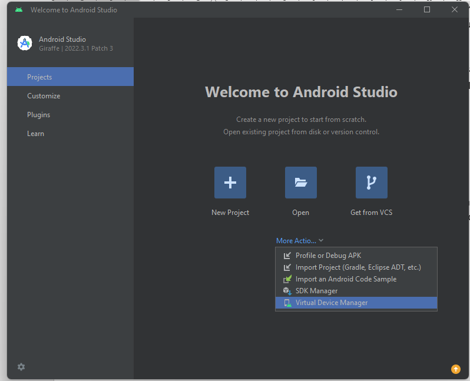

## <h1 align="center">II. Backend</h1>
## 2. Configuración

2.1. **[Preparar del backend](#21-preparar-el-proyecto)**
<br>2.2. **[Iniciar el backend](#22-iniciar-el-proyecto)**
<br>2.3. **[Configurar el backend](#23-ejecutar-el-backend)**
<br>2.4. **[Estructurar el backend](#24-configurar-el-backend)**
<br>2.5. **[Ejecutar el backend](#25-estructurar-el-backend)**

**<div align="center"><a href="../react_native.md">Menú React Native</a></div>**

---
## 2.1. Preparar el backend
&nbsp;

#### 2.1.1. Ingresar a la carpeta "backend"

&nbsp;&nbsp;&nbsp;&nbsp;&nbsp;&nbsp;&nbsp;&nbsp;&nbsp; ● &nbsp; Ingresar a la carpeta **'backend'** y eliminar el archivo **'delete'**:
<br>&nbsp;&nbsp;&nbsp;&nbsp;&nbsp;&nbsp;&nbsp;&nbsp;&nbsp; ● &nbsp; Abrir una terminal de Visual Studio Code ('Terminal / New Terminal' ó 'Ctrl + Shift + ñ')
<br>&nbsp;&nbsp;&nbsp;&nbsp;&nbsp;&nbsp;&nbsp;&nbsp;&nbsp; ● &nbsp; En la terminal ir a la carpeta "backend" con el siguiente comando:

```bash
cd backend
```

#### 2.1.2. Personalizar la Terminal

&nbsp;&nbsp;&nbsp;&nbsp;&nbsp;&nbsp;&nbsp;&nbsp;&nbsp; ● &nbsp; Cambiar el nombre de la terminal a **'backend'**, seleccionándola en la parte inferior derecha y presionando F2 / Rename...
<br>&nbsp;&nbsp;&nbsp;&nbsp;&nbsp;&nbsp;&nbsp;&nbsp;&nbsp; ● &nbsp; Cambiar el color de la terminal **'backend'**, dando click derecho / Chage Color... / Seleccionar el color
<br>&nbsp;&nbsp;&nbsp;&nbsp;&nbsp;&nbsp;&nbsp;&nbsp;&nbsp; ● &nbsp; Cambiar el icono de la terminal **'backend'**, dando click derecho / Chage Icon... / Seleccionar el icono

**<div align="right"><a href="#punto-2-configuración-del-proyecto">Volver al Menú</a></div>**

---
## 2.2. Iniciar el backend
&nbsp;

#### 2.2.1. Crear el 'package.json'

&nbsp;&nbsp;&nbsp;&nbsp;&nbsp;&nbsp;&nbsp;&nbsp;&nbsp; ● &nbsp; En la Terminal de 'Visual Studio Code' digitar lo siguiente:

```powershell
ni package.json -ItemType File -Force
```

**<div align="right"><a href="#punto-2-configuración-del-proyecto">Volver al Menú</a></div>**

---
## 2.3. Configurar el backend
&nbsp;

#### 2.2.1. Configurar el 'package.json'

&nbsp;&nbsp;&nbsp;&nbsp;&nbsp;&nbsp;&nbsp;&nbsp;&nbsp; ● &nbsp; Copiar y pegar el siguiente código en el archivo 'package.json':

```json
 1  {
 2    "name": "api_nodejs_express",
 3    "version": "1.0.0",
 4    "description": "",
 5    "main": "index.js",
 6    "scripts": {
 7      "start": "node server.js",
 8      "dev": "nodemon index.js",
 9      "test": "echo \"Error: no test specified\" && exit 1"
10    },
11    "keywords": [
12      "api",
13      "nodejs",
14      "express"
15    ],
16    "author": "Albeiro Ramos",
17    "license": "MIT",
18    "dependencies": {
19      "bcryptjs": "^3.0.2",
20      "cors": "^2.8.5",
21      "dotenv": "^17.2.3",
22      "express": "^4.21.2",
23      "http": "^0.0.1-security",
24      "jsonwebtoken": "^9.0.2",
25      "morgan": "^1.10.0",
26      "mysql": "^2.18.1",
27      "passport": "^0.7.0",
28      "passport-jwt": "^4.0.1",
29      "swagger-jsdoc": "^6.2.8",
30      "swagger-ui-express": "^5.0.1"
31    },
32    "devDependencies": {
33      "nodemon": "^3.1.11"
34    }
35  }
```

&nbsp;&nbsp;&nbsp;&nbsp;&nbsp;&nbsp;&nbsp;&nbsp;&nbsp; ● &nbsp; Instalar las dependencias:

```bash
npm i
```

**<div align="right"><a href="#punto-2-configuración-del-proyecto">Volver al Menú</a></div>**

---
## 2.4. Estructurar el backend
&nbsp;

#### 2.4.1. Estructura del backend:

	# C = Carpetas
	# A = Archivos

	proyecto/                               	# C. Backend y Frontend de un proyecto software (web o móvil).
		└── backend/                      # C. Lógica del servidor Node.js para la gestión de datos y API.
		    ├── config/                   # C. Configuración del backend (base de datos, claves, autenticación).
		    │   ├── config.js             # A. Configuración principal del backend (variables de entorno, BD, etc.).
		    │   ├── keys.js               # A. Claves secretas para seguridad (JWT, OAuth, servicios externos).
		    │   ├── passport.js           # A. Configuración de la estrategia de autenticación con Passport.js.
		    │   └── swagger.js            # A. Documentación con swagger.
		    ├── controllers/              # C. Manejan la lógica de negocio y conexión entre rutas y modelos.
		    │   └── userController.js     # A. Controlador para las operaciones relacionadas con los usuarios (CRUD, login).
		    ├── middlewares/              # C. Funciones que interceptan las peticiones HTTP (autenticación, validaciones).
		    │   └── authMiddleware.js     # A. Middleware para verificar autenticación/autorización de usuarios.
		    ├── models/                   # C. Definición de modelos de datos que representan tablas en la base de datos.
		    │   └── user.js               # A. Esquema del modelo de usuario (campos, validaciones, consultas SQL).
		    ├── node_modules/             # C. Dependencias externas instaladas vía NPM.
		    ├── routes/                   # C. Define las rutas de la API que conectan con los controladores.
		    │   └── userRoutes.js         # A. Endpoints relacionados con usuarios (registro, login, CRUD).
		    ├── .env                      # A. Cadena de conexión a la base de datos.
		    ├── .gitignore                # A. Ignorar archivos y carpetas del proyecto
		    ├── index.js                  # A. Punto principal de entrada del backend. Carga 'server.js' y arranca la app.
		    ├── package-lock.json         # A. Versiones exactas de las dependencias instaladas.
		    ├── package.json              # A. Manifest del backend (nombre del proyecto, scripts, dependencias).
		    └── server.js                 # A. Configuración del servidor Express (middlewares, rutas, DB, etc.).


#### 2.5.2. Crear la Estructura del backend:

&nbsp;&nbsp;&nbsp;&nbsp;&nbsp;&nbsp;&nbsp;&nbsp;&nbsp; ● &nbsp; Crear las **Carpetas** y **Archivos** del backend, copiando el siguiente código:

```bash
mkdir -p src/data
mkdir -p src/data/repositories
ni src/data/repositories/AuthRepository.tsx -ItemType File -Force
ni src/data/repositories/UserLocalRepository.tsx -ItemType File -Force
mkdir -p src/data/sources
mkdir -p src/data/sources/local
ni src/data/sources/local/LocalStorage.tsx -ItemType File -Force
mkdir -p src/data/sources/remote
mkdir -p src/data/sources/remote/api
ni src/data/sources/remote/api/ApiDelivery.tsx -ItemType File -Force
mkdir -p src/data/sources/remote/models
ni src/data/sources/remote/models/ResponseApiDelivery.tsx -ItemType File -Force
mkdir -p src/domain
mkdir -p src/domain/entities
ni src/domain/entities/User.tsx -ItemType File -Force
mkdir -p src/domain/repositories
ni src/domain/repositories/AuthRepository.tsx -ItemType File -Force
ni src/domain/repositories/UserLocalRepository.tsx -ItemType File -Force
mkdir -p src/domain/useCases
mkdir -p src/domain/useCases/auth
ni src/domain/useCases/auth/LoginAuth.tsx -ItemType File -Force
ni src/domain/useCases/auth/RegisterAuth.tsx -ItemType File -Force
mkdir -p src/domain/useCases/userLocal
ni src/domain/useCases/userLocal/GetUserLocal.tsx -ItemType File -Force
ni src/domain/useCases/userLocal/RemoveUserLocal.tsx -ItemType File -Force
ni src/domain/useCases/userLocal/SaveUserLocal.tsx -ItemType File -Force
mkdir -p src/presentation
mkdir -p src/presentation/components
ni src/presentation/components/CustomTextInput.tsx -ItemType File -Force
ni src/presentation/components/RoundedButton.tsx -ItemType File -Force
mkdir -p src/presentation/hooks
ni src/presentation/hooks/useUserLocal.tsx -ItemType File -Force
mkdir -p src/presentation/theme
ni src/presentation/theme/AppTheme.tsx -ItemType File -Force
mkdir -p src/presentation/views
mkdir -p src/presentation/views/home
ni src/presentation/views/home/Home.tsx -ItemType File -Force
ni src/presentation/views/home/Styles.tsx -ItemType File -Force
ni src/presentation/views/home/ViewModel.tsx -ItemType File -Force
mkdir -p src/presentation/views/profile
mkdir -p src/presentation/views/profile/info
ni src/presentation/views/profile/info/ProfileInfo.tsx -ItemType File -Force
ni src/presentation/views/profile/info/ViewModel.tsx -ItemType File -Force
mkdir -p src/presentation/views/register
ni src/presentation/views/register/Register.tsx -ItemType File -Force
ni src/presentation/views/register/Styles.tsx -ItemType File -Force
ni src/presentation/views/register/ViewModel.tsx -ItemType File -Force

```

&nbsp;&nbsp;&nbsp;&nbsp;&nbsp;&nbsp;&nbsp;&nbsp;&nbsp; ● &nbsp; Pegar el código en la terminal (Verificar que esté en **..\frontend>**) y presione la tecla **ENTER**.

---
## 2.4. Estructurar el backend
&nbsp;

**<div align="right"><a href="#punto-2-configuración-del-proyecto">Volver al Menú</a></div>**

---
<div align="right">
  <table border="0">
    <tr>      
      <td align="center">1. <a href="01_entorno.md">Entorno de Desarrollo</a></td>
      <td align="center"><a href="../react_native.md">Menú Principal de React</a></td>
      <td align="center">3. <a href="03_frontend.md">Frontend</a></td>
    </tr>
  </table>
</div>

<!--  -->