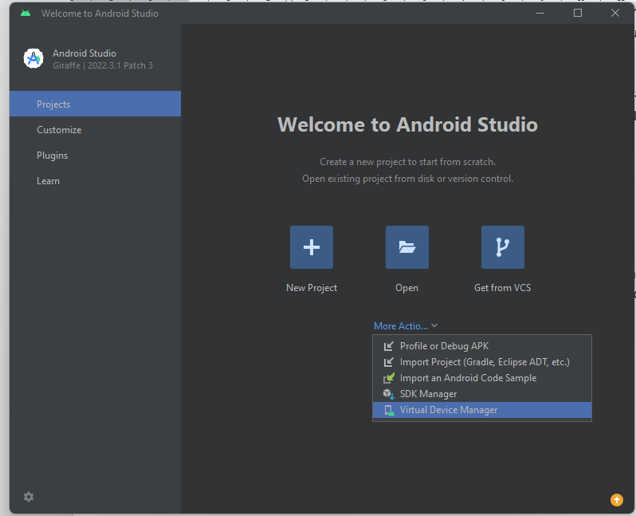

# 📝Punto 2: Configuración del Proyecto

1. **[Preparar del Proyecto](#1-preparar-el-proyecto)**
2. **[Iniciar del Proyecto](#2-iniciar-el-proyecto)**
3. **[Ejecutar el Proyecto](#3-ejecutar-el-proyecto)**
4. **[Configurar el Proyecto](#4-configurar-el-proyecto)**
5. **[Crear la Estructura del Proyecto](#5-crear-la-estructura-del-proyecto)**

<br>

**<div align="center"><a href="../react_native.md">Menú React Native</a></div>**

---
## 1. Preparar el Proyecto
&nbsp;

### 1.1. Descargar el '.ZIP' del Repositorio :

- Ir a **[07_Computacion_movil](https://github.com/UniminutoProfeAlbeiro/07_computacion_movil/tree/main)** y descargar el archivo '.ZIP'.
- Descomprimir el '.ZIP' y cambiar el nombre del proyecto.

### 1.2. Crear un repositorio en Github

- Colocar el nombre del proyecto al Repositorio Creado 
- En caso de no tener cuenta en Github, crear una (**[Ver Anexo 01. Trabajar con Github](../../../anexos/anexo01_trabajar_con_github.md)**).

### 1.3. Abrir el Proyecto en Visual Studio Code.

- Asociar el proyecto con Visual Studio Code
- Abrir una terminal de Visual Studio Code
	- Cambiar el nombre de la terminal a **'frontend'**, seleccionándola en la parte inferior derecha y presionando F2 / Rename...            
	- Cambiar el color de la terminal **'frontend'**, dando click derecho / Chage Color... / Seleccionar el color
- Ingresar a la carpeta **'frontend'** y eliminar el archivo **'delete'**:

**<div align="right"><a href="#punto-2-estructura-del-proyecto">Volver al Menú</a></div>**

---
## 2. Iniciar el Proyecto
&nbsp;

### 2.1. Crear el Proyecto

- En la terminal de Visual Studio Code, crear el proyecto con el siguiente comando:

  ```bash
  npx create-expo-app frontend --template blank-typescript
	```	

&nbsp;&nbsp;&nbsp;&nbsp;&nbsp;&nbsp;&nbsp;&nbsp;&nbsp;&nbsp; ? Select an Expo SDK version: » - Use arrow-keys. Return to submit.<br>
&nbsp;&nbsp;&nbsp;&nbsp;&nbsp;&nbsp;&nbsp;&nbsp;&nbsp;&nbsp; > Latest (SDK 57) - Recommended for most projects **# <ins>Seleccionar esta opción**</ins><br>
&nbsp;&nbsp;&nbsp;&nbsp;&nbsp;&nbsp;&nbsp;&nbsp;&nbsp;&nbsp; Other SDK version…<br>
<br>
&nbsp;&nbsp;&nbsp;&nbsp;&nbsp;&nbsp;&nbsp;&nbsp;&nbsp;&nbsp; Creating frontend using the blank-typescript template.<br>
<br>
&nbsp;&nbsp;&nbsp;&nbsp;&nbsp;&nbsp;&nbsp;&nbsp;&nbsp;&nbsp; √ Downloaded and extracted project files.<br>
&nbsp;&nbsp;&nbsp;&nbsp;&nbsp;&nbsp;&nbsp;&nbsp;&nbsp;&nbsp; > npm install<br>
&nbsp;&nbsp;&nbsp;&nbsp;&nbsp;&nbsp;&nbsp;&nbsp;&nbsp;&nbsp; npm warn deprecated uuid@7.0.3: uuid@10 and below is no longer supported.  For ESM codebases, update to uuid@latest.  For<br>
&nbsp;&nbsp;&nbsp;&nbsp;&nbsp;&nbsp;&nbsp;&nbsp;&nbsp;&nbsp; CommonJS codebases, use uuid@11 (butbe aware this version will likely be deprecated in 2028).<br>
<br>
&nbsp;&nbsp;&nbsp;&nbsp;&nbsp;&nbsp;&nbsp;&nbsp;&nbsp;&nbsp; added 467 packages, and audited 468 packages in 3m<br>
<br>
&nbsp;&nbsp;&nbsp;&nbsp;&nbsp;&nbsp;&nbsp;&nbsp;&nbsp;&nbsp; 45 packages are looking for funding<br>
&nbsp;&nbsp;&nbsp;&nbsp;&nbsp;&nbsp;&nbsp;&nbsp;&nbsp;&nbsp;   run `npm fund` for details<br>
<br>
&nbsp;&nbsp;&nbsp;&nbsp;&nbsp;&nbsp;&nbsp;&nbsp;&nbsp;&nbsp; 10 moderate severity vulnerabilities<br>
<br>
&nbsp;&nbsp;&nbsp;&nbsp;&nbsp;&nbsp;&nbsp;&nbsp;&nbsp;&nbsp; To address issues that do not require attention, run:<br>
&nbsp;&nbsp;&nbsp;&nbsp;&nbsp;&nbsp;&nbsp;&nbsp;&nbsp;&nbsp;   npm audit fix<br>
<br>
&nbsp;&nbsp;&nbsp;&nbsp;&nbsp;&nbsp;&nbsp;&nbsp;&nbsp;&nbsp; To address all issues (including breaking changes), run:<br>
&nbsp;&nbsp;&nbsp;&nbsp;&nbsp;&nbsp;&nbsp;&nbsp;&nbsp;&nbsp; npm audit fix --force<br>
<br>
&nbsp;&nbsp;&nbsp;&nbsp;&nbsp;&nbsp;&nbsp;&nbsp;&nbsp;&nbsp; Run `npm audit` for details.<br>
<br>
&nbsp;&nbsp;&nbsp;&nbsp;&nbsp;&nbsp;&nbsp;&nbsp;&nbsp;&nbsp; ✅ Your project is ready!<br>
<br>
&nbsp;&nbsp;&nbsp;&nbsp;&nbsp;&nbsp;&nbsp;&nbsp;&nbsp;&nbsp; To run your project, navigate to the directory and run one of the following npm commands.<br>
<br>
&nbsp;&nbsp;&nbsp;&nbsp;&nbsp;&nbsp;&nbsp;&nbsp;&nbsp;&nbsp; - cd frontend<br>
&nbsp;&nbsp;&nbsp;&nbsp;&nbsp;&nbsp;&nbsp;&nbsp;&nbsp;&nbsp; - npm run android<br>
&nbsp;&nbsp;&nbsp;&nbsp;&nbsp;&nbsp;&nbsp;&nbsp;&nbsp;&nbsp; - npm run ios # you need to use macOS to build the iOS project - use the Expo app if you need to do iOS development without a Mac<br>
&nbsp;&nbsp;&nbsp;&nbsp;&nbsp;&nbsp;&nbsp;&nbsp;&nbsp;&nbsp; - npm run web<br>
&nbsp;&nbsp;&nbsp;&nbsp;&nbsp;&nbsp;&nbsp;&nbsp;&nbsp;&nbsp; ? You are creating a project inside of an existing Git repository. Skip initializing a new git repository? » (Y/n) **# <ins>Escribir YES**</ins><br>
&nbsp;&nbsp;&nbsp;&nbsp;&nbsp;&nbsp;&nbsp;&nbsp;&nbsp;&nbsp; npm notice<br>
&nbsp;&nbsp;&nbsp;&nbsp;&nbsp;&nbsp;&nbsp;&nbsp;&nbsp;&nbsp; npm notice New minor version of npm available! 11.9.0 -> 11.19.1<br>
&nbsp;&nbsp;&nbsp;&nbsp;&nbsp;&nbsp;&nbsp;&nbsp;&nbsp;&nbsp; npm notice Changelog: https://github.com/npm/cli/releases/tag/v11.19.1<br>
&nbsp;&nbsp;&nbsp;&nbsp;&nbsp;&nbsp;&nbsp;&nbsp;&nbsp;&nbsp; npm notice To update run: npm install -g npm@11.19.1<br>
&nbsp;&nbsp;&nbsp;&nbsp;&nbsp;&nbsp;&nbsp;&nbsp;&nbsp;&nbsp; npm notice<br>
<br>

**<div align="right"><a href="#punto-2-estructura-del-proyecto">Volver al Menú</a></div>**

---
## 3. Ejecutar el Proyecto
&nbsp;

### 3.1. Ingresar a la carpeta "frontend"

- En la terminal de Visual Studio Code ingresar al proyecto creado "frontend" con el siguiente comando:

	```bash
	cd frontend
	```

### 3.2. Ejecutar el proyecto en el Emulador Android

- En la terminal de Visual Studio Code ejecutar el siguiente comando para iniciar el proyecto en el emulador Android:

	```bash
	npm run android
	```

&nbsp;&nbsp;&nbsp;&nbsp;&nbsp;&nbsp;&nbsp;&nbsp;&nbsp;&nbsp; > frontend@1.0.0 android<br>
&nbsp;&nbsp;&nbsp;&nbsp;&nbsp;&nbsp;&nbsp;&nbsp;&nbsp;&nbsp; > expo start --android<br>
<br>
&nbsp;&nbsp;&nbsp;&nbsp;&nbsp;&nbsp;&nbsp;&nbsp;&nbsp;&nbsp; Starting project at D:\PROYECTOS\07_computacion_movil\frontend<br>
&nbsp;&nbsp;&nbsp;&nbsp;&nbsp;&nbsp;&nbsp;&nbsp;&nbsp;&nbsp; Starting Metro Bundler<br>
<br>
&nbsp;&nbsp;&nbsp;&nbsp;&nbsp;&nbsp;&nbsp;&nbsp;&nbsp;&nbsp; › Opening emulator Pixel_6a<br>
&nbsp;&nbsp;&nbsp;&nbsp;&nbsp;&nbsp;&nbsp;&nbsp;&nbsp;&nbsp; › Opening exp://192.168.78.145:8081 on Pixel_6a<br>

&nbsp;&nbsp;&nbsp;&nbsp;&nbsp;&nbsp;&nbsp;&nbsp;&nbsp;&nbsp; 

&nbsp;&nbsp;&nbsp;&nbsp;&nbsp;&nbsp;&nbsp;&nbsp;&nbsp;&nbsp; › Scan the QR code above to open in Expo Go.<br>
&nbsp;&nbsp;&nbsp;&nbsp;&nbsp;&nbsp;&nbsp;&nbsp;&nbsp;&nbsp; › Metro: exp://192.168.78.145:8081<br>
<br>
&nbsp;&nbsp;&nbsp;&nbsp;&nbsp;&nbsp;&nbsp;&nbsp;&nbsp;&nbsp; › Using Expo Go (Press s to switch to development build)<br>
&nbsp;&nbsp;&nbsp;&nbsp;&nbsp;&nbsp;&nbsp;&nbsp;&nbsp;&nbsp; › Press ? │ show all commands<br>
<br>
&nbsp;&nbsp;&nbsp;&nbsp;&nbsp;&nbsp;&nbsp;&nbsp;&nbsp;&nbsp; Logs for your project will appear below. Press Ctrl+C to exit.<br>
&nbsp;&nbsp;&nbsp;&nbsp;&nbsp;&nbsp;&nbsp;&nbsp;&nbsp;&nbsp; Android Bundled 4881ms index.ts (708 modules)

### 3.3. Ejecutar el proyecto en el dispositivo móvil

- **Requisito previo**: Descargar e instalar la aplicación **"Expo Go"** desde la **Google Play Store (Android)** o **App Store (iOS)** en el teléfono.
- Asegurar que el teléfono y el computador estén **conectados a la misma red Wi-Fi**.
- Abrir la app Expo Go en el teléfono.
- **Android**: Tocar el botón **"Scan QR code"** y escanear el código QR que aparece en la terminal del computador.
- **iOS**: Abrir la aplicación de **Cámara de tu iPhone** y apuntar al código QR. Preguntará si se desea abrir en Expo Go.
- **Problemas de conexión**: Si no conecta, presionar **Ctrl+C en la terminal para detener el servidor** y ejecutar: 

	```bash
	npx expo start --tunnel --clear # Esto usa un túnel para sortear restricciones de red
	```

**<div align="right"><a href="#punto-2-estructura-del-proyecto">Volver al Menú</a></div>**


---
## 4. Configurar el Proyecto
&nbsp;

### 4.1. Modificar el archivo 'package.json' 

- Archivo Original

```json
 1    {
 2      "name": "frontend",
 3      "version": "1.0.0",
 4      "main": "index.ts",
 5      "dependencies": {
 6        "expo": "~57.0.23",
 7        "expo-status-bar": "~57.0.1",
 8        "react": "19.2.3",
 9        "react-native": "0.86.3"
10      },
11      "devDependencies": {
12        "@types/react": "~19.2.2",
13        "typescript": "~6.0.3"
14      },
15      "scripts": {
16        "start": "expo start",
17        "android": "expo start --android",
18        "ios": "expo start --ios",
19        "web": "expo start --web"
20      },
21      "private": true
22    }
```

- Archivo Modificado para la web

```json
 1    {
 2      "name": "frontend",
 3      "version": "1.0.0",
 4      "main": "index.ts",
 5      "dependencies": {
 6        "expo": "~57.0.23",
 7        "expo-status-bar": "~57.0.1",
 8        "react": "19.2.3",
 9        "react-dom": "19.2.3",
10        "react-native": "0.86.3",
11        "react-native-web": "^0.21.2"
12      },
13      "devDependencies": {
14        "@types/react": "~19.2.2",
15        "typescript": "~6.0.3"
16      },
17      "scripts": {
18        "start": "expo start",
19        "android": "expo start --android",
20        "ios": "expo start --ios",
21        "web": "expo start --web"
22      },
23      "private": true
24    }
```

- Modificar el código del 'package.json', para asegurar que el proyecto funcione correctamente. Se incluyen las dependencias necesarias para el proyecto, según se requiera para que funcione con o sin el emulador Android. 

- Para que funcione CON el Emulador:
                    
	```json
	{
		"name": "frontend_mob",
		"version": "1.0.0",
		"main": "index.ts",
		"scripts": {
			"start": "expo start",
			"android": "expo start --android",
			"ios": "expo start --ios",
			"web": "expo start --web"
		},
		"dependencies": {
			"@react-native-async-storage/async-storage": "2.2.0",
			"@react-navigation/native": "^7.1.28",
			"@react-navigation/native-stack": "^7.10.1",
			"@react-navigation/stack": "^7.6.16",
			"axios": "^1.13.2",
			"expo": "~54.0.32",
			"expo-status-bar": "~3.0.9",
			"react": "19.1.0",
			"react-native": "0.81.5",
			"react-native-safe-area-context": "~5.6.0",
			"react-native-screens": "~4.16.0"
		},
		"devDependencies": {
			"@types/react": "~19.1.0",
			"typescript": "~5.9.2"
		},
		"private": true
	}
	```


- Para que funcione correctamente SIN el emulador Android, modificar el código del 'package.json' de la siguiente manera:
                    
	```bash
	{
		"name": "frontend_mob",
		"version": "1.0.0",
		"main": "index.ts",
		"scripts": {    
			"start": "expo start --tunnel --clear",
			"start:local": "expo start --host lan --clear",
			"start:offline": "expo start --offline --clear",
			"android": "echo 'NO USAR - Busca emulador' && exit 1",
			"ios": "echo 'NO USAR - Busca emulador' && exit 1",
			"web": "expo start --web"
		},
		"dependencies": {
			"@react-native-async-storage/async-storage": "2.2.0",
			"@react-navigation/native": "^7.1.28",
			"@react-navigation/native-stack": "^7.10.1",
			"@react-navigation/stack": "^7.6.16",
			"axios": "^1.13.2",
			"expo": "~54.0.32",
			"expo-status-bar": "~3.0.9",
			"react": "19.1.0",
			"react-native": "0.81.5",
			"react-native-safe-area-context": "~5.6.0",
			"react-native-screens": "~4.16.0"
		},
		"devDependencies": {
			"@types/react": "~19.1.0",
			"typescript": "~5.9.2"
		},
		"private": true
	}
	```

### 4.2. Modificar el archivo 'App.tsx' 

- En 'frontend_mob/App.tsx' modificar la línea 7 :

		```tsx
		 1    import { StatusBar } from 'expo-status-bar';
		 2    import { StyleSheet, Text, View } from 'react-native';
		 3  
		 4    export default function App() {
		 5      return (
		 6        <View style={styles.container}>
		 7          <Text>¡Hola Mundo!</Text>
		 8          <StatusBar style="auto" />
		 9        </View>
		10      );
		11    }
		12  
		13    const styles = StyleSheet.create({
		14      container: {
		15        flex: 1,
		16        backgroundColor: '#fff',
		17        alignItems: 'center',
		18        justifyContent: 'center',
		19      },
		20    });
		```

**<div align="right"><a href="#punto-2-estructura-del-proyecto">Volver al Menú</a></div>**

---
## 5. Crear la Estructura del Proyecto
&nbsp;


	# C = Carpetas
	# A = Archivos

	proyecto/                                      		       # C. Proyecto móvil en React Native.
	└── frontend_mob/                                 		   # C. Carpeta raíz del proyecto en React Native.
			├── .expo/                                         # C. Configuraciones del proyecto utilizados por la herramienta 'Expo'
			├── assets/                                        # C. Recursos estáticos (imágenes, fuentes).
			├── node_modules/                                  # C. Dependencias (librerías) instaladas para el frontend_mob.
			├── src/                                           # C. Carpetas y archivos de la aplicación React Native.
			│   ├── data/                                      # C. Capa para obtención y manipulación de datos.
			│   │   ├── repositories/                          # C. Interfaces para acceder a diferentes fuentes de datos.
			│   │   │   ├── AuthRepository.tsx                 # A. Lógica para la autenticación.
			│   │   │   └── UserLocalRepository.tsx            # A. Gestión de datos del usuario a nivel local (AsyncStorage).
			│   │   └── sources/                               # C. Implementaciones concretas de las fuentes de datos (local, remota).
			│   │       ├── local/                             # C. Lógica para acceder a datos almacenados localmente.
			│   │       │   └── LocalStorage.tsx               # A. Interactua con el almacenamiento local (AsyncStorage).
			│   │       └── remote/                            # C. Interactua con la API del backend (clientes API).
			│   │           ├── api/                           # C. Clientes o servicios para realizar llamadas a la API.
			│   │           │   └── ApiDelivery.tsx            # A. Cliente para interactuar con la API relacionada con "delivery".
			│   │           └── models/                        # C. Estructuras de datos que se reciben de la API.
			│   │               └── ResponseApiDelivery.tsx	   # A. Tipo de la respuesta de la API de "delivery".
			│   ├── domain/                                    # C. Lógica de negocio y entidades del dominio (independiente).
			│   │   ├── entities/                              # C. Estructuras de los objetos del negocio (User).
			│   │   │   └── User.tsx                           # A. Entidad de usuario con sus propiedades (nombre, email).
			│   │   ├── repositories/                          # C. Interfaces para acceder a los datos (implementado en Data).
			│   │   │   ├── AuthRepository.tsx                 # A. Interfaz para las operaciones de autenticación.
			│   │   │   └── UserLocalRepository.tsx            # A. Interfaz para la gestión de datos locales del usuario.
			│   │   └── useCases/                              # C. Lógica de negocio específica de la aplicación (dominio/data).
			│   │       ├── auth/                              # C. Casos de uso relacionados con la autenticación (Login, Register).
			│   │       │   ├── LoginAuth.tsx                  # A. Lógica para el proceso de inicio de sesión del usuario.
			│   │       │   └── RegisterAuth.tsx               # A. Lógica para el proceso de registro de nuevos usuarios.
			│   │       └── userLocal/                         # C. Casos de uso relacionados con la gestión local del usuario.
			│   │           ├── GetUserLocal.tsx               # A. Obtener información del usuario almacenado localmente.
			│   │           ├── RemoveUserLocal.tsx            # A. Eliminar información del usuario almacenado localmente.
			│   │           └── SaveUserLocal.tsx              # A. Guardar la información del usuario localmente.
			│   └── presentation/                              # C. Capa de la interfaz y presentación de datos (components, views).
			│       ├── components/                            # C. Componentes de interfaz de usuario (inputs, buttons).
			│       │   ├── CustomTextInput.tsx                # A. Componente de entrada de texto personalizado con estilos.
			│       │   └── RoundedButton.tsx                  # A. Componente de botón con estilos de bordes redondeados.
			│       ├── hooks/                                 # C. Hooks personalizados para lógica de presentación reutilizable.
			│       │   └── useUserLocal.tsx                   # A. Hook personalizado para manipular la información local del usuario.
			│       ├── theme/                                 # C. Estilos y la temática visual general de la aplicación.
			│       │   └── AppTheme.tsx                       # A. Paleta de colores, tipografía y estilos consistentes.
			│       └── views/                                 # C. Pantallas o vistas principales de la aplicación.
			│           ├── home/                              # C. Archivos relacionados con la pantalla principal de la aplicación.
			│           │   ├── Home.tsx                       # A. Componente principal de la pantalla inicio (Home).
			│           │   ├── Styles.tsx                     # A. Estilos específicos para los componentes de la pantalla inicio.
			│           │   └── ViewModel.tsx                  # A. Lógica de presentación para la pantalla inicio.
			│           ├── profile/                           # C. Archivos relacionados con la pantalla de perfil del usuario.
			│           │   └── info/                          # C. Archivos relacionados con la información del perfil del usuario.
			│           │       ├── ProfileInfo.tsx            # A. Componente para mostrar la información del perfil del usuario.
			│           │       └── ViewModel.tsx              # A. Lógica de presentación para la información del perfil del usuario.
			│           └── register/                          # C. Archivos relacionados con la pantalla de registro de usuarios.
			│               ├── Register.tsx                   # A. Componente principal de la pantalla de registro de usuarios.
			│               ├── Styles.tsx                     # A. Estilos específicos para los componentes de la pantalla de registro.
			│               └── ViewModel.tsx                  # A. Lógica de presentación para la pantalla de registro de usuarios.
			├── .gitignore                                     # A. Archivos y carpetas que Git debe ignorar (node_modules, etc.).
			├── app.json                                       # A. Configuración utilizada por Expo para configurar la app.
			├── App.tsx                                        # A. Raíz de la aplicación React Native (punto de entrada UI).
			├── index.ts                                       # A. Punto de entrada para la aplicación React Native (fuera de Expo).
			├── package-lock.json                              # A. Registra las versiones exactas de las dependencias del frontend_mob.
			├── package.json                                   # A. Manifiesto del proyecto frontend_mob (nombre, dependencias, scripts).
			└── tsconfig.json                                  # A. Configuración para el compilador de TypeScript.

4.1. Copiar de este mismo proyecto las imágenes que se encuentra en [assets](../assets/). 

&nbsp;

NOTA:

Si está en Github, puede utilizar este recurso https://download-directory.github.io/ para descargar las imágenes pasándole el enlace

&nbsp;


4.2. Pegar las imágenes al proyecto, en la carpeta 'frontend/frontend_mob/assets'.


<div align="right"><a href="#-punto-1-entorno-de-desarrollo">Volver al Menú</a></div>


&nbsp;
### NOTA:

Si tiene dificultades, abra el abra el puerto 3000 en Firewall con los siguiente pasos:

01.	Presione Windows + R, escriba wf.msc y presiona Enter															
02.	Vaya a "Reglas de entrada" en el panel izquierdo															
03.	Haga clic en "Acción" → "Nueva regla..."															
04.	Seleccione "Puerto" → Siguiente															
05.	En "Puertos locales específicos" escriba: 3000															
06.	Seleccione "Permitir la conexión" → Siguiente															
07.	Marque todas las opciones (Dominio, Privado, Público) → Siguiente															
08.	Póngale un nombre como "Puerto 3000 Backend" → Finalizar


<div align="right"><a href="#-punto-1-entorno-de-desarrollo">Volver al Menú</a></div>

---
<div align="right">
  <table border="0">
    <tr>      
      <td align="center">1. <a href="01_entorno.md">Entorno de Desarrollo</a></td>
      <td align="center"><a href="../react_native.md">Menú Principal de React</a></td>
      <td align="center">2. <a href="03_frontend.md">Estructura del Proyecto</a></td>
    </tr>
  </table>
</div>

<!--  -->