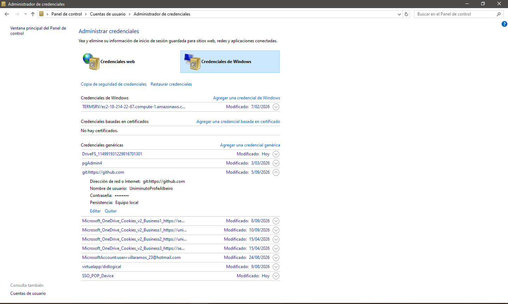

## ANEXO 01: Trabajar con GitHub

1. [Instalar Git](#1-instalar-git)
2. [Subir el proyecto a un repositorio 'Github'](#2-subir-el-proyecto-a-un-repositorio-github)
3. [Clonar un Repositorio en 'Github'](#3-clonar-un-repositorio-github)

<br>

**<div align="center"><a href="../02_hibrido_/react_native/react_native.md">Menú React Native</a></div>**

---
## 1. Instalar Git
&nbsp;

#### 1.1. Descargar [Git](https://git-scm.com/downloads).

#### 1.2. Instalar Git, siguiendo los pasos del instalador.


<div align="right"><a href="#anexo-01-trabajar-con-github">Volver al Menú</a></div>

---
## 2. Subir el proyecto a un repositorio 'Github'
&nbsp;

Para evitar confusiones y seguir los pasos correctamente, la carpeta raíz del proyecto se llamará 'proyecto'.

#### 2.1. Verificar que no haya una cuenta de 'Github' asociada al computador

&nbsp;&nbsp;&nbsp;&nbsp;&nbsp;&nbsp; ● &nbsp; Abrir el 'Panel de Control'
<br>&nbsp;&nbsp;&nbsp;&nbsp;&nbsp;&nbsp; ● &nbsp; Dar click en 'Cuentas de usuario / Administrar credenciales de Windows'. 
<br>&nbsp;&nbsp;&nbsp;&nbsp;&nbsp;&nbsp; ● &nbsp; Si hay una cuenta asociada (Ver imagen), click sobre la cuenta y la opción 'Quitar'. 




### Nota:

&nbsp;&nbsp;&nbsp;&nbsp;&nbsp;&nbsp;&nbsp;&nbsp;&nbsp; ● &nbsp; De no funcionar este método porque no tiene acceso al Panel de control, abra el 'PowerShell' y escriba lo siguiente: 

```powershell
echo "protocol=https`nhost=github.com`n" | git credential-manager erase
```

#### 2.2. Crear una carpeta en su computador con el nombre 'proyecto'. 

&nbsp;&nbsp;&nbsp;&nbsp;&nbsp;&nbsp; ● &nbsp; Verificar que tenga por lo menos un archivo, ya que Github no guarda carpetas, solo archivos.

#### 2.3. Crear una cuenta en [Github](https://github.com/signup?source=login).

#### 2.4. Crear un Repositorio

&nbsp;&nbsp;&nbsp;&nbsp;&nbsp;&nbsp; ● &nbsp; Dar click al 'Nombre de su cuenta / Your Repositories'. 
<br>&nbsp;&nbsp;&nbsp;&nbsp;&nbsp;&nbsp; ● &nbsp; Dar click en 'New'. 
<br>&nbsp;&nbsp;&nbsp;&nbsp;&nbsp;&nbsp; ● &nbsp; En 'Repository name', escribir el nombre de la carpeta raíz de su proyecto (ejemplo, 'proyecto'). 
<br>&nbsp;&nbsp;&nbsp;&nbsp;&nbsp;&nbsp; ● &nbsp; La carpeta raíz no debe tener espacios, ni caracteres compuestos, ni caracteres especiales
<br>&nbsp;&nbsp;&nbsp;&nbsp;&nbsp;&nbsp; ● &nbsp; Dar click en 'Create Repository'.

#### 2.5. Subir el Proyecto a Github

&nbsp;&nbsp;&nbsp;&nbsp;&nbsp;&nbsp; ● &nbsp; Click derecho sobre la carpeta raíz y seleccionar la opción 'Open Git Bash here'.
<br>&nbsp;&nbsp;&nbsp;&nbsp;&nbsp;&nbsp; ● &nbsp; En el 'Git Bash' escribir lo siguiente:

```bash
git config --global user.name "nombre de su cuenta"  # Nombre con el que creò su cuenta en 'Github'.
```
```bash
git config --global user.email "correo de su cuenta" # Correo con el que registró su cuenta en 'Github'.
```
```bash
git init
```
```bash
git branch -M main
```
```bash
git remote add origin 'enlace al repositorio' # Lo puede copiar del repositorio que está creando en 'Github'.
```
```bash
git add .
```
```bash
git commit -m "Subiendo Proyecto"
```
```bash
git push -u origin main
```

#### 2.6. Aceptar Autenticación de Credenciales

&nbsp;&nbsp;&nbsp;&nbsp;&nbsp;&nbsp; ● &nbsp; Va a aparecer una ventana denominada 'Connect to Github'
<br>&nbsp;&nbsp;&nbsp;&nbsp;&nbsp;&nbsp; ● &nbsp; Dar click en la opción 'Sign in with your browser'
<br>&nbsp;&nbsp;&nbsp;&nbsp;&nbsp;&nbsp; ● &nbsp; Dar click en 'Authentication Succeeded'. 
<br>&nbsp;&nbsp;&nbsp;&nbsp;&nbsp;&nbsp; ● &nbsp; Escribir las credenciales de 'Github'. 
<br>&nbsp;&nbsp;&nbsp;&nbsp;&nbsp;&nbsp; ● &nbsp; En el 'Git Bash' debe aparecer texto similar al siguiente:

```
Enumerating objects: 3, done.
Counting objects: 100% (3/3), done.
Writing objects: 100% (3/3), 226 bytes | 226.00 KiB/s, done.
Total 3 (delta 0), reused 0 (delta 0), pack-reused 0 (from 0)
To https://github.com/SenaProfeAlbeiro/proyecto.git
* [new branch]      main -> main
branch 'main' set up to track 'origin/main'.
```

#### 2.7. Actualizar la ventana del navegador donde se encuentra abierta su cuenta de 'Github'


#### 2.8. Actualizar el Proyecto cuando se realice algún cambio

&nbsp;&nbsp;&nbsp;&nbsp;&nbsp;&nbsp; ● &nbsp; En el 'Git bash' escribir los siguientes comandos:

```bash
git add .
```
```bash
git commit -m "Comentario del cambio"
```
```bash
git push 
```

<div align="right"><a href="#anexo-01-trabajar-con-github">Volver al Menú</a></div>

---
## 3. Clonar un Repositorio 'Github'
&nbsp;

#### 3.1. Abrir su cuenta de 'Github'

#### 3.2. Clonar el 'Repositorio'

&nbsp;&nbsp;&nbsp;&nbsp;&nbsp;&nbsp; ● &nbsp; En la parte superior derecha, dar click al 'Nombre de su cuenta / Your Repositories'. 
<br>&nbsp;&nbsp;&nbsp;&nbsp;&nbsp;&nbsp; ● &nbsp; Dar click al proyecto que desea clonar
<br>&nbsp;&nbsp;&nbsp;&nbsp;&nbsp;&nbsp; ● &nbsp; Dar click en la opción '<> Code / Copy url to clipboard'.
<br>&nbsp;&nbsp;&nbsp;&nbsp;&nbsp;&nbsp; ● &nbsp; En su computador dar click derecho sobre el área de trabajo 
<br>&nbsp;&nbsp;&nbsp;&nbsp;&nbsp;&nbsp; ● &nbsp; Seleccionar la opción 'Open Git Bash here'.
<br>&nbsp;&nbsp;&nbsp;&nbsp;&nbsp;&nbsp; ● &nbsp; En el 'Git Bash' pegar el repositorio clonado de 'Github' con 'CTRL + INSERT':

```bash
git clone 'pegar el enlace del repositorio de Github'
```

### Nota:

&nbsp;&nbsp;&nbsp;&nbsp;&nbsp;&nbsp;&nbsp;&nbsp;&nbsp; ● &nbsp; Si el proyecto ya se encuentra en el computador, puede actualizar la información con:
				
```bash
git pull
```

#### 3.3. Abrir el proyecto en Visual Studio Code.


<div align="right"><a href="#anexo-01-trabajar-con-github">Volver al Menú</a></div>


---

<div align="right">
  <table border="0">
    <tr>      
      <td align="right">Anexo 02. <a href="anexo02_problemas_con_puertos_en_xampp.md">Problemas con Puertos en Xampp</a></td>
    </tr>
  </table>
</div>

<!--  -->